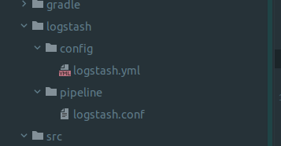
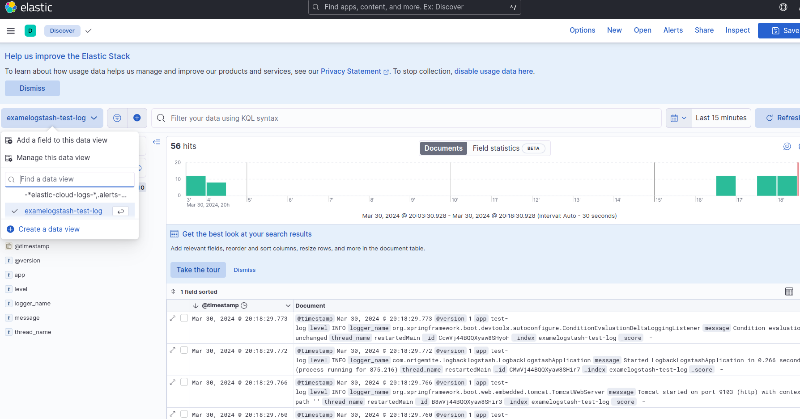

## **Springboot -> Logback -> Logstash** ##  
base docker-compose  
로그스테쉬 프로젝트
gradle  
  

logstash setting  
  

appname 
  
  

management -> indexmanagenent  

data view -> create data view

discover -> select  

  